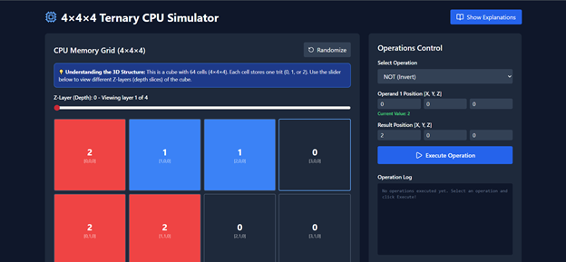
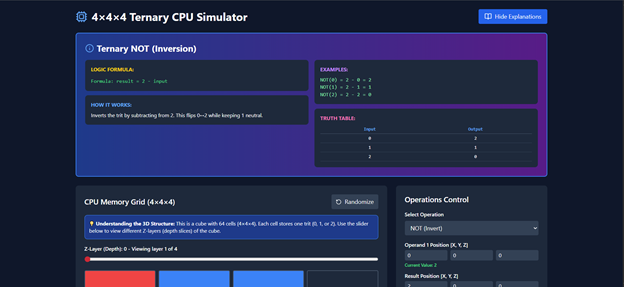

# 🔢 4×4×4 Ternary CPU Simulator  
### An Interactive Trit-Based CPU Built in React

This project simulates a **4×4×4 ternary CPU**, where each memory cell stores a **trit** (0, 1, or 2) instead of binary bits.  
The simulator demonstrates how ternary logic, arithmetic, and multi-digit base-3 operations behave inside a 3D CPU architecture - all inside a 2D web interface.

---

## 🚀 Features

### 🧱 **4×4×4 Ternary Memory Grid**
- 64 trit-based memory cells  
- Click to cycle values (0 → 1 → 2 → 0)  
- Z-axis slider to view each depth layer  
- Visual color-coded trit representation  

### 🔣 **Complete Ternary Logic Unit**
Includes all major single and multi-input ternary operations:

| Unary Ops | Binary Ops |

|----------|------------|

| NOT (2 - t) | AND (min) |

| CYCLE | OR (max) |

|  | XOR ((a + b) % 3) |

|  | NAND |

|  | NOR |

|  | CONSENSUS (fault-tolerant vote) |

Every operation includes:
- logic formula  
- examples  
- optional truth tables  
- UI explanation panel  

---

## ➕ **Base-3 Arithmetic Engine**

### ✔ Single-Trit Arithmetic
- ADD with carry  
- SUBTRACT with borrow  

### ✔ Multi-Trit Arithmetic
- Full 4-digit base-3 addition (MULTI_ADD)
- Carry propagation across all trits
- Overflow detection

---

## 🧠 How the CPU Simulation Works

1. **Read** - Fetch trits from `[X, Y, Z]` coordinates  
2. **Process** - Apply ternary logic / arithmetic  
3. **Write** - Store output at the result coordinate  
4. **Propagate** - Carry/borrow stored in adjacent cells  

The UI also shows a **live operation log**.

---

## 📸 Screenshots

---

## 🛠 Tech Stack

- **React**
- **TailwindCSS**
- **Lucide Icons**
- Pure JavaScript math logic (no external libraries for CPU logic)

---

## 🤝 Contributing
PRs and feature ideas are welcome - especially for:
- more ternary logic gates  
- additional visualization modes  
- performance optimizations  

---

## 📜 License
MIT License — free for personal and academic use.

---

## ⭐ If you like this project…
Give the repo a **star** ⭐ and share with others interested in **ternary computing**!

